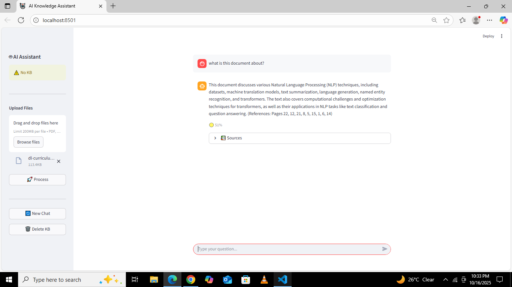
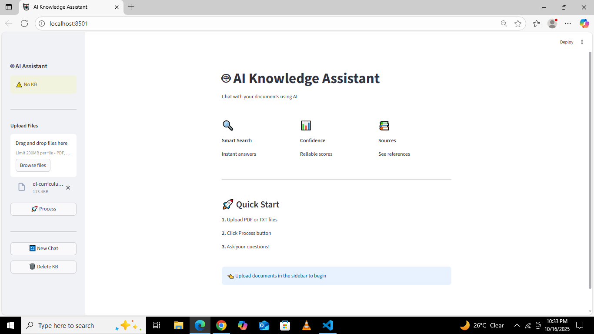

# Customer Support Knowledge Base Assistant

A private, intelligent chatbot that helps customer support teams query their internal documents securely using retrieval-augmented generation (RAG). Ask questions in natural language and get accurate answers from your own knowledge base—all processed locally with no external data sharing.

## Overview

This project solves a common problem: searching through tons of documentation to find answers. Instead of manually digging through PDFs and text files, you can simply ask questions and get instant, context-aware responses with source citations.

Everything runs locally. Your documents never leave your system, making it perfect for handling sensitive customer data and internal processes.

## Features

- **Document Processing** - Upload PDF and TXT files to build your searchable knowledge base
- **Semantic Search** - Find answers based on meaning, not just keywords, using FAISS vector search
- **Natural Conversations** - Chat naturally with Mistral-7B-Instruct LLM integration
- **Source Citations** - Every answer includes confidence scores and document references
- **Feedback Collection** - Track response quality with thumbs up/down for continuous improvement
- **Privacy First** - All processing happens locally with no external API calls for document storage

## Tech Stack

- **LangChain** - Document processing and RAG pipeline
- **HuggingFace Transformers** - Embeddings and language models
- **FAISS** - Vector similarity search
- **Streamlit** - Interactive web interface
- **Python 3.9+**

## Screenshots

| Chat Interface                      | Sidebar                             |
| ----------------------------------- | ----------------------------------- |
|  |  |

## Quick Start

### Installation

```bash
# Clone the repository
git clone https://github.com/Mehwash-shahzadi/rag-document-chatbot.git
cd customer-support-chatbot

# Create virtual environment
python -m venv .venv
source .venv/bin/activate  # On Windows: .\.venv\Scripts\activate

# Install dependencies
pip install -r requirements.txt

# Set up environment variables
cp .env.example .env
```

### Configuration

Add your HuggingFace API token to `.env`:

```env
HUGGINGFACEHUB_API_TOKEN=your_token_here
EMBEDDING_MODEL=sentence-transformers/all-MiniLM-L6-v2
LLM_MODEL=mistralai/Mistral-7B-Instruct-v0.2
```

Get your free API token from [HuggingFace](https://huggingface.co/).

### Running the App

```bash
streamlit run app.py
```

Open your browser to `http://localhost:8501`, upload your documents via the sidebar, click "Process Documents", and start asking questions.

## Project Structure

```
customer-support-chatbot/
├── app.py                     # Main Streamlit application
├── .env                       # Environment configuration
├── requirements.txt           # Python dependencies
├── config/
│   └── settings.py            # Configuration loader
└── src/
    ├── document_processor.py  # Document ingestion and chunking
    ├── embeddings.py          # Vector embeddings generation
    ├── vector_store.py        # FAISS database management
    ├── retriever.py           # Document retrieval logic
    ├── chatbot.py             # LLM response generation
    └── utils.py               # Helper functions
```

## Configuration Options

Customize settings in your `.env` file:

| Variable                   | Description                    | Default                                  |
| -------------------------- | ------------------------------ | ---------------------------------------- |
| `HUGGINGFACEHUB_API_TOKEN` | HuggingFace API key (required) | -                                        |
| `EMBEDDING_MODEL`          | Model for text embeddings      | `sentence-transformers/all-MiniLM-L6-v2` |
| `LLM_MODEL`                | Language model for responses   | `mistralai/Mistral-7B-Instruct-v0.2`     |
| `CHUNK_SIZE`               | Text chunk size for processing | `500`                                    |
| `CHUNK_OVERLAP`            | Overlap between chunks         | `50`                                     |
| `TOP_K`                    | Number of results to retrieve  | `3`                                      |
| `VECTOR_DB_PATH`           | Vector store directory         | `./vector_db`                            |
| `RAW_DOCS_PATH`            | Raw document storage path      | `./docs`                                 |

## Troubleshooting

| Issue                      | Solution                                           |
| -------------------------- | -------------------------------------------------- |
| Missing API token error    | Add `HUGGINGFACEHUB_API_TOKEN` to your `.env` file |
| Virtual environment issues | Ensure `.venv` is activated before running         |
| No documents found         | Upload and process documents using the sidebar     |
| Rate limit errors          | Wait and retry, or upgrade HuggingFace tier        |
| File upload fails          | Only PDF and TXT formats are currently supported   |

## Roadmap

- [ ] User authentication and multi-user support
- [ ] Additional file formats (DOCX, HTML, Markdown)
- [ ] Admin analytics dashboard
- [ ] Model fine-tuning capabilities
- [ ] Docker containerization
- [ ] Cloud deployment templates (AWS, Azure, GCP)
